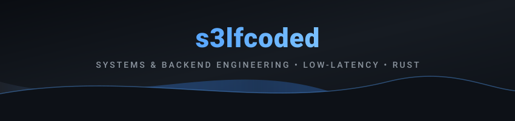

<div align="center">



</div>

```text
  _____ ___  _  __               _          _       s3lfcoded@baremetal
 / ___/|_  )| |/ _|___ ___   __| | ___  __| |      -------------------
 \___ \ / / | |  _/ __/ _ \ / _` |/ -_)/ _` |      OS       : Linux / POSIX
 ____/ /___/|_|_| \___\___/ \__,_|\___|\__,_|      STACK    : Systems & Low-Latency
                                                   RUNTIME  : Tokio Async / Zero-Cost
                                                   FOCUS    : Concurrent Engines & I/O
```

<div align="center">

### Tech Stack & Tooling

<p align="center">
  
</p>

---

### Featured Works

<table width="100%">
  <tr>
    <td width="50%" valign="top">
      <h3 align="center">⚡ FerriteKV</h3>
      <p align="center">
        <b>In-Memory Key-Value Database in Rust</b><br/>
        Wire-compatible with Redis (RESP2 protocol).
      </p>
      <ul>
        <li>Zero-copy streaming parser (<code>BytesMut</code>)</li>
        <li>64-way sharded lock storage concurrency</li>
        <li>Non-blocking AOF disk persistence on Tokio</li>
        <li><b>57,000+ ops/sec</b> sustained @ 1kk stress test</li>
      </ul>
      <p align="center">
        <a href="https://github.com/s3lfcoded/ferrite-kv"><b>&rarr; View Repository</b></a>
      </p>
    </td>
    <td width="50%" valign="top">
      <h3 align="center">🔬 Systems & Internals</h3>
      <p align="center">
        <b>Low-Level Research & Experiments</b><br/>
        Concurrent primitives and systems code.
      </p>
      <ul>
        <li>Lock contention profiling under parallel load</li>
        <li>Zero-allocation network packet slicing</li>
        <li>Cache-friendly data layouts & memory models</li>
        <li>Async event-driven architectures</li>
      </ul>
      <p align="center">
        <a href="https://github.com/s3lfcoded?tab=repositories"><b>&rarr; Explore Repositories</b></a>
      </p>
    </td>
  </tr>
</table>

---

### Contribution Activity

<picture>
  <source media="(prefers-color-scheme: dark)" srcset="./assets/github-snake-dark.svg">
  <source media="(prefers-color-scheme: light)" srcset="./assets/github-snake.svg">
  
</picture>

---

<p align="center">
  <a href="https://github.com/s3lfcoded">
    
  </a>
</p>


</div>
